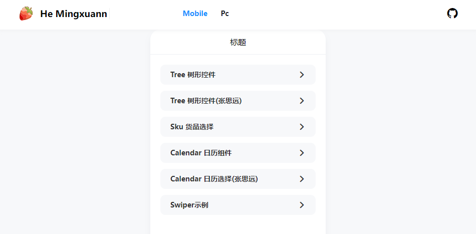

  
  
  
  
  
  

## Vue2 组件合集 欢迎 star

vue 版本`2.6.14`

## 在线访问

访问链接: [https://lan-he.github.io/mingxuan-component/](https://lan-he.github.io/mingxuan-component/)

## 功能介绍

-   tree 树形选择器
-   日历组件
-   深景效果
-   日历选择
-   sku 选择
-   滚动插件
-   美丽的三种 404 页面

---

## Ecosystem

| Project      | Status                                     | Description                     |
| ------------ | ------------------------------------------ | ------------------------------- |
| [vue-router] | [![vue-router-status]][vue-router-package] | Single-page application routing |
| [vuex]       | [![vuex-status]][vuex-package]             | Large-scale state management    |
| [vue-cli]    | [![vue-cli-status]][vue-cli-package]       | Project scaffolding             |
| [vue-loader] | [![vue-loader-status]]                     |

[vue-router]: https://github.com/vuejs/vue-router
[vuex]: https://github.com/vuejs/vuex
[vue-cli]: https://github.com/vuejs/vue-cli
[vue-loader]: https://github.com/vuejs/vue-loader
